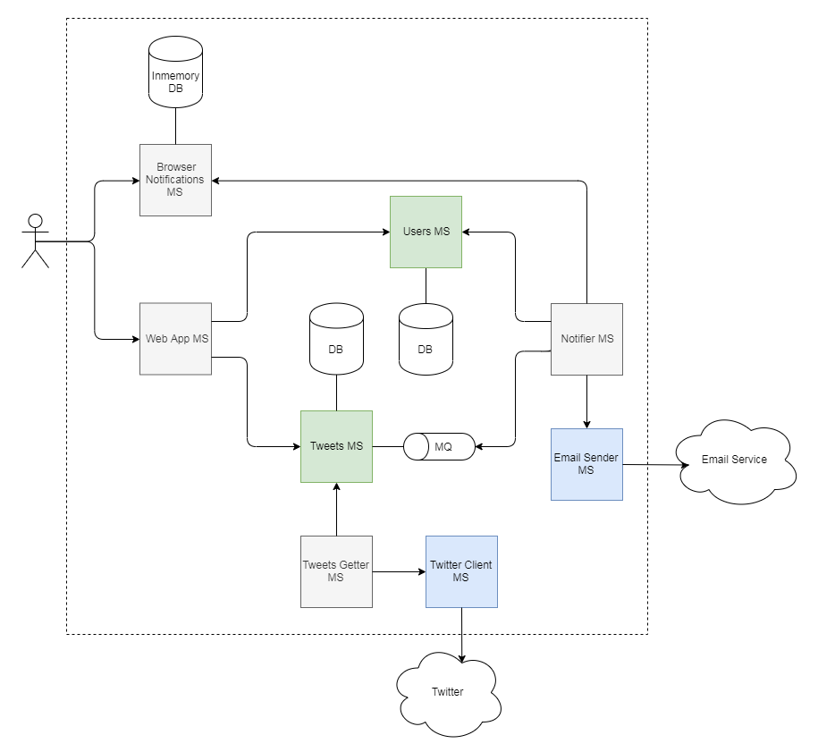

Twisub
======

Приложение для подписки на твиты по запросам.

Пользователи приложения могут создавать запросы на поиск твиттов в [Twitter](https://twitter.com).
Система по этим запросам периодически обращается в Twitter и получает свежие твиты.
Твиты сохраняются и становятся доступными для просмотра пользователям приложения.


## Архитектура

На рисунке показана схема зависимостей микросервисов.



* **Users MS** хранит учетные данные пользователей.
* **Tweets MS** хранит пользовательские запросы и твиты по этим запросам, полученные из Твиттера.
* **Twitter Client MS** является посредником между Twitter API и приложением. Принимает синхронные запросы на поиск твиттов в Твиттере.
* **Tweets Getter MS** реализует периодическую задачу поиска твиттов по пользовательским запросам. Он обращается в *Tweets MS* для получения запросов, с которыми он обращается в Твиттер через *Twitter Client MS*.
* **Web App MS** - фронтальное веб-приложение.
* **Notifier MS** осуществляет рассылку пользователям новых твитов. Подписан на очередь сообщений с новыми твитами.
* **Email Sender MS** реализует рассылку сообщений по email адресам пользователей.


## Сборка проекта

Требуемое ПО:

* [JDK 8](https://www.oracle.com/technetwork/java/javase/downloads/jdk8-downloads-2133151.html)
* [Docker](https://www.docker.com/)

Команда для сборки Docker-образов:

```sh
$ ./gradlew :buildImages
```


## Настройка

#### Подключение к Twitter API

По умолчанию для получения твитов реального обращения к Twitter API не происходит, а используется мокирующий сервис.
Для обращения к Twitter API необходимо задать значения соответствующих переменных окружения в файле [docker/.env](docker/.env).

```env
...
TWITTER_CONSUMER_KEY=consumer_key
TWITTER_CONSUMER_SECRET=consumer_secret
TWITTER_ACCESS_TOKEN=access_token
TWITTER_ACCESS_TOKEN_SECRET=access_token_secret
...
```

Эти данные доступны на [портале разработчиков](https://developer.twitter.com/) после регистрации.
Далее в файле [docker/docker-compose.yaml](docker/docker-compose.yaml) необходимо заменить значение переменной `APP_TWITTERCLIENTURL` на `http://ms-twitterclient:8080`:

```yaml
...
  ms-tweetsgetter:
    ...
    environment:
      APP_TWITTERCLIENTURL: http://ms-twitterclient:8080
      ...
...
```

#### Подключение к почтовому сервису

Настройки подключения к почтовому сервису находятся в файле [docker/.env](docker/.env):

```env
...
MAIL_HOST=smtp.gmail.com
MAIL_PORT=587
MAIL_USERNAME=username
MAIL_PASSWORD=password
...
```


## Запуск

Запуск осуществляется при помощи утилиты `docker-compose` из папки [docker](docker):

```sh
$ cd docker
$ docker-compose up
```
